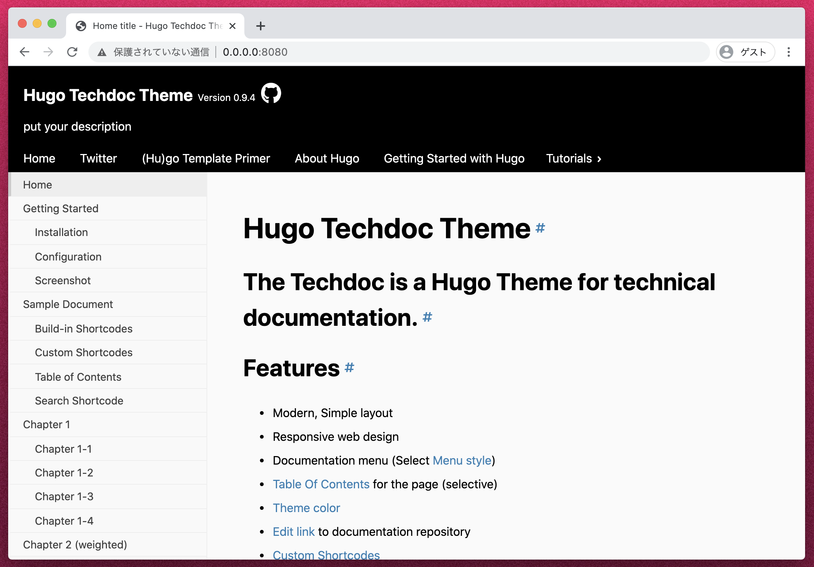

# HandOn hugo

## 作り方

+ 公式ドキュメント
  + https://gohugo.io/getting-started/quick-start/

## 

+ 作業のコンテナ起動
  + nginx のみが起動している状態

```
sh docker-build-run.sh 
```

+ コンテナにログインする ---> :whale:

```
docker exec -it $(cat docker-build-run.sh | grep _I_TAG | awk -F\' 'NR==1 {print $2}') /bin/ash
```

## 新規作成する

+ :whale: `new-doc` というプロジェクトを新規作成する

```
hugo new site new-doc
```
```
### Ex.

# hugo new site new-doc
Congratulations! Your new Hugo site is created in /opt/hejda/handson-hugo/new-doc.

Just a few more steps and you're ready to go:

1. Download a theme into the same-named folder.
   Choose a theme from https://themes.gohugo.io/ or
   create your own with the "hugo new theme <THEMENAME>" command.
2. Perhaps you want to add some content. You can add single files
   with "hugo new <SECTIONNAME>/<FILENAME>.<FORMAT>".
3. Start the built-in live server via "hugo server".

Visit https://gohugo.io/ for quickstart guide and full documentation.
```
```
cd new-doc
```

+ 記事追加

```
hugo new posts/my-first-post.md
```

+ サーバ立ち上げ

```
hugo server -D --bind="0.0.0.0"
```

+ nginx 経由で確認
  + 0.0.0.0:8080

--->  このままだと白い

+ 一旦止める

```
{Ctl + C}
```

## theme を入れてみる

+ Techdoc
  + https://themes.gohugo.io/hugo-theme-techdoc/


+ clone

```
git clone https://github.com/thingsym/hugo-theme-techdoc.git themes/hugo-theme-techdoc
```

```
echo 'theme = "hugo-theme-techdoc"' >> config.toml
```


```
hugo server --themesDir -D --bind="0.0.0.0"
```

+ ブラウザで確認




```
hugo --minify
```


## 作り直し

```
docker stop $(cat docker-build-run.sh | grep _I_TAG | awk -F\' 'NR==1 {print $2}')
docker rm $(cat docker-build-run.sh | grep _I_TAG | awk -F\' 'NR==1 {print $2}')
```
